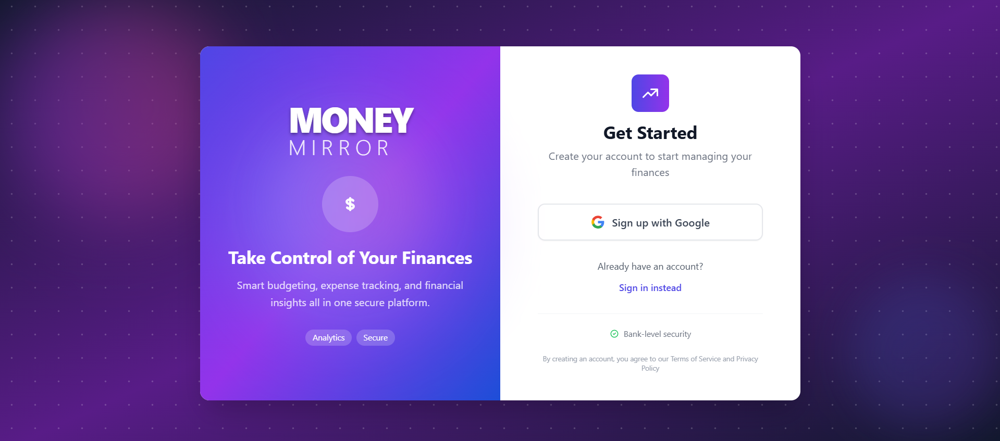
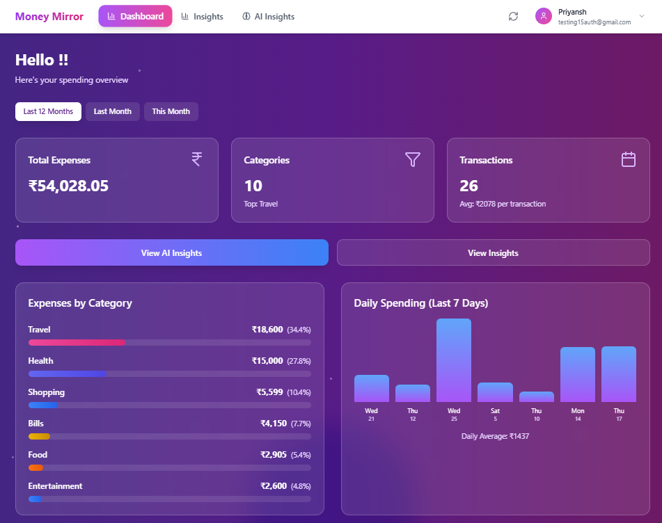
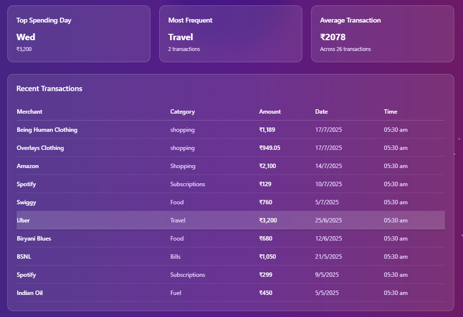
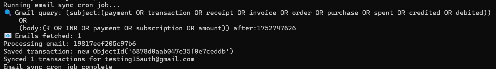
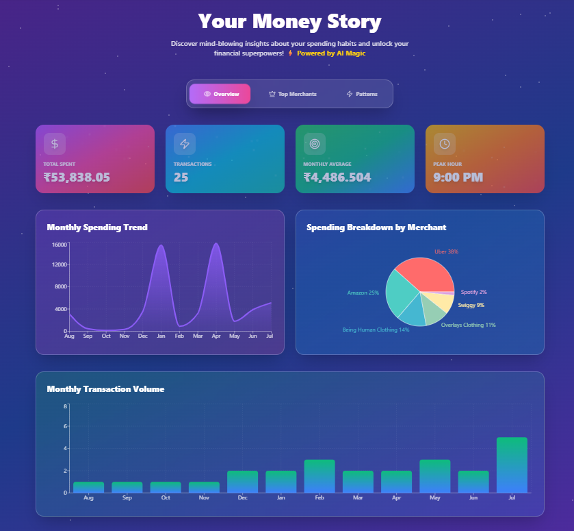
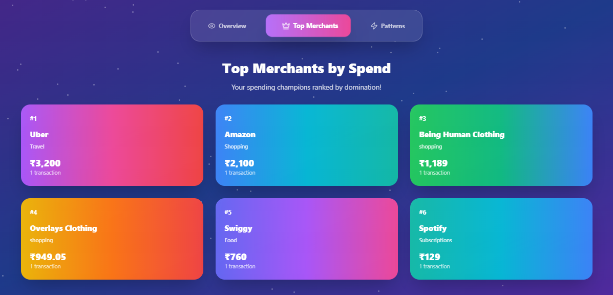
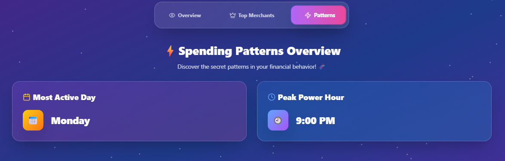
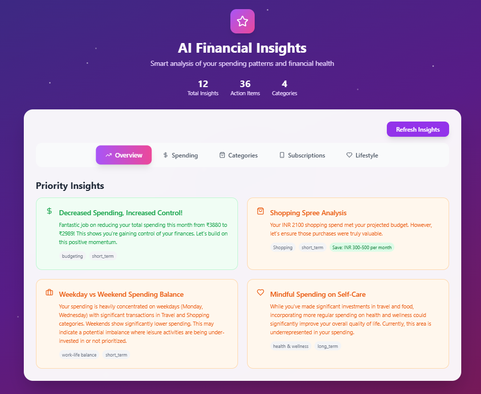

# Money-Mirror – Smart Expense & Subscription Analyzer

**Money-Mirror** is a full-stack intelligent financial analyzer that securely parses Gmail inboxe for transactional data, categorizes it using AI, and delivers rich dashboards and financial summaries. It helps users track their expenses, identify subscriptions, and gain insights into their spending habits.


## Live URL
Access the project here: [http://money-mirror.xyz](http://money-mirror.xyz)


## Features

- **Smart Email Parsing**
  - Secure Gmail integration via OAuth2
  - Automatically fetches and extracts relevant financial data from emails
  - Cron job based background sync + on-demand sync

- **Smart Syncing**
  - One-minute auto-sync after login
  - Background cron jobs for daily Gmail polling

- **MongoDB Aggregation Pipelines**
  - Efficient data aggregation and transformation for dashboards
  - Category breakdowns, time-series expense graphs, and merchant analytics

- **Secure OAuth Authentication**
  - Full session-based login using access/refresh tokens
  - Protected routes and token lifecycle handling

- **Interactive Visual Dashboards**
  - Category and merchant trends
  - Expense heatmaps over days/weeks/months
  - React + Chart.js visualizations

- **AI-Powered Human-Like Insights**
  - Generates contextual, human-readable summaries
  - Actionable financial tips based on recent activity

- **Dynamic Visual Dashboard**
  - Breakdown by time, category, and merchant
  - Trend graphs for daily, weekly, and monthly spending

- **Subscription Detection**
  - Detects recurring expenses and potential subscriptions
  - Flags them visually and includes them in summaries

- **Extensible API Design**
  - Modular Express routes for auth, sync, insights, and transactions
  - Clean controller-based structure
  - OAuth-based Gmail integration with access/refresh token handling

- **Security**
  - OAuth tokens are stored securely
  - Secrets managed through environment variables


## Tech Stack

### Backend

- Node.js + Express.js
- MongoDB (via Mongoose)
- Google OAuth2 API
- Gemini
- node-cron for scheduled jobs

### Deployment

- Docker & Docker Compose
- AWS EC2 (Ubuntu) for hosting
- NGINX as reverse proxy
- Domain integration (e.g. money-mirror.xyz)
### Frontend

- React.js (Vite)
- Tailwind CSS 
- Chart.js
- React Router DOM


## Project Walkthrough (Screenshots)

This section visually demonstrates the user flow and core features of **Money-Mirror**. 

### 1. Login & Authentication  
OAuth2-based Google Sign-In with secure token handling.


### 2. Dashboard Overview  
Category-wise spending breakdown and subscription highlights.  



### 3. Gmail Sync & Parsing  
On-demand and CRON-based sync with parsing logic.  


### 4. Insight Cards 
Human-readable insights with interactive graphs




### 5. Insights (AI-Powered)  
Understand your money with AI-powered, practical advice.


## Setup Instructions

### 1. Clone the Repository

```bash
git clone https://github.com/yourusername/Money-Mirror.git
cd Money-Mirror
```

### 2. Configure Environment

Create a `.env` file in `backend/`

**Example for `backend/.env`:**

```env
MONGODB_URI=your-mongo-uri
GOOGLE_CLIENT_ID=your-client-id
GOOGLE_CLIENT_SECRET=your-client-secret
JWT_SECRET=your-jwt-secret
```

### 3. Run with Docker

```bash
docker compose build
docker compose up -d
```


## API Endpoints

| Method | Endpoint                               | Description                                      |
|--------|----------------------------------------|--------------------------------------------------|
| GET    | `/api/auth/google`                    | Starts Google OAuth login flow                   |
| GET    | `/api/auth/google/callback`           | Handles OAuth redirect                           |
| POST   | `/api/auth/logout`                    | Logs out the user                                |
| GET    | `/api/auth/profile`                   | Fetches authenticated user profile               |
| GET    | `/api/auth/frontend-protect`          | Used by frontend to verify session + Gmail link  |
| POST   | `/api/gmail/sync`                     | Triggers Gmail sync and stores transactions      |
| GET    | `/api/insights/ai`                    | Returns AI-generated financial insights          |
| GET    | `/api/insights/raw`                   | Returns raw data for graphs and charts           |
| GET    | `/api/transactions/getTransactions`   | Returns all transactions                         |
| GET    | `/api/transactions/getTransactionsByRange` | Returns transactions within date range       |

---

